

## Teste de estágio, CRUD de usuários

---

Esse é um projeto que realiza um crud(Create, Update, Delete) de Usuarios.

---

             Tecnologias Utilizadas  

- IDE:[ Visual studio Code](https://code.visualstudio.com/).
- SGBD: [ MySQL Workbench](https://dev.mysql.com/downloads/workbench/).
- Framework: [Laravel V7.x](https://laravel.com/docs/7.x)

---

        Versões

- PHP v7.4.6, a 8 funciona mas pode gerar bugs.

- Composer 2.2.6

---
        Instalação

- Faça o donwload do arquivo do projeto 
---
- Configurar a conexão do banco de dados no arquivo . env  como é mostrado a baixo.

<a href="https://laravel.com" target="_blank">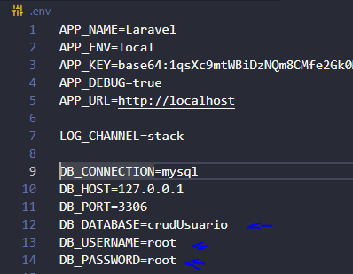</a>

---

- Criação de um banco de dados no MySQL Workbench.

    -> Use o comando: create database crudUsuario;

<a href="https://laravel.com" target="_blank">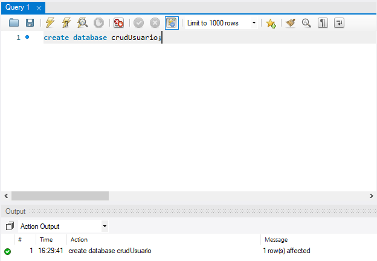</a>

---

- Execute as migrate no terminal, utilizando o comando: php artisan migrate, se a criação das migrate for bem sucedido, você terá um resultado como o mostrado a baixo.

<a href="https://laravel.com" target="_blank">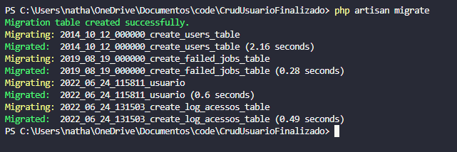</a>

- Agora chegou a hora da diversão, vamos criar um servidor para nossa aplicação, é bem simples, execulte o comando: php artisan serve em seu terminal.

<a href="https://laravel.com" target="_blank">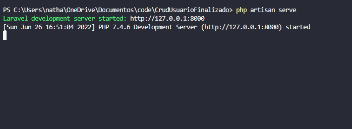</a>

clique no link e a aplicação irá abrir em seu navegador.

---
             Como Utilizar

- Para acessar a aplicação é preciso fazer login, mas se for o seu primeiro acesso você pode se registrar de forma rapida e simples.
---

        Telas

- LOGIN

<a href="https://laravel.com" target="_blank">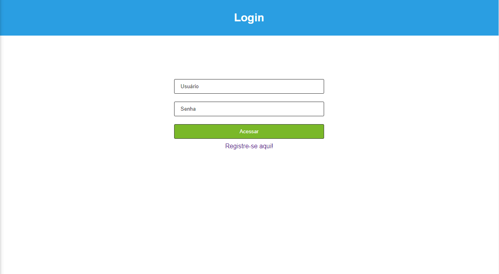</a>

- CADASTRO

<a href="https://laravel.com" target="_blank">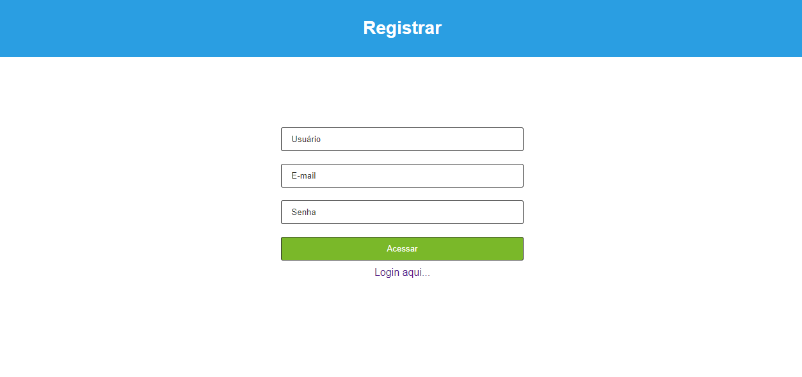</a>

- HOME -> pagina simbolica

<a href="https://laravel.com" target="_blank">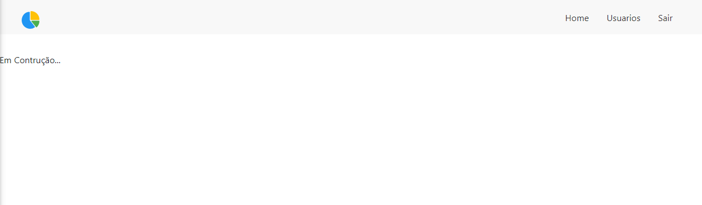</a>

- USUÁRIO 

<a href="https://laravel.com" target="_blank">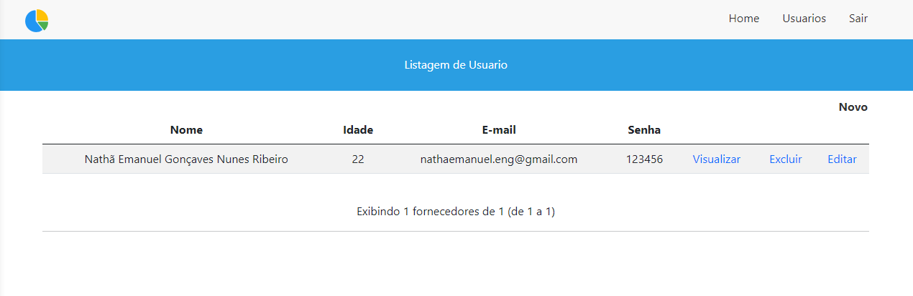</a>

- CADASTRO DE USUÁRIO 

<a href="https://laravel.com" target="_blank">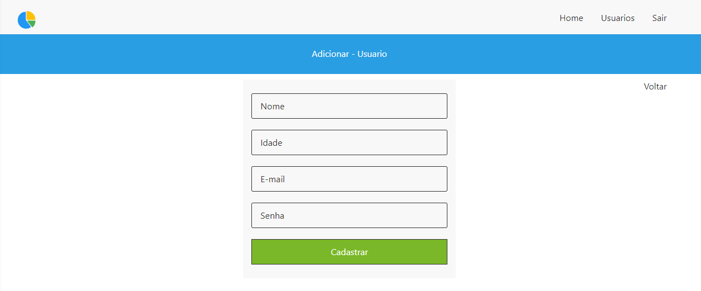</a>

- EDIÇÃO DE USUÁRIO 

<a href="https://laravel.com" target="_blank">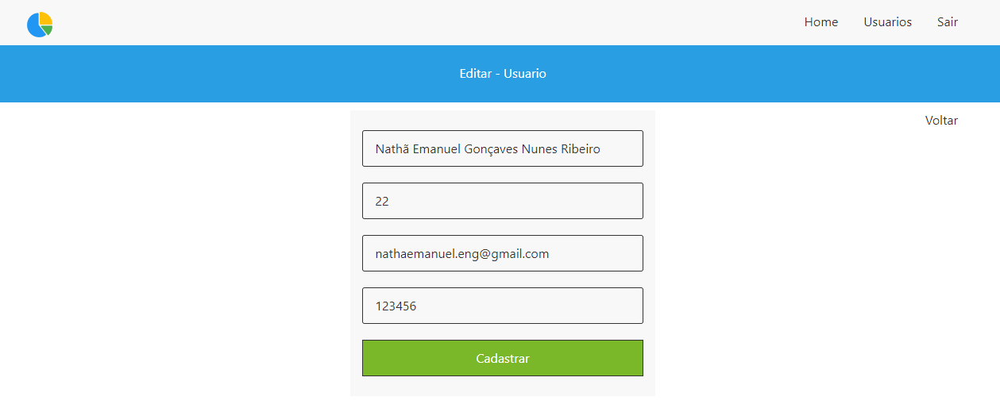</a>

- VISUALIZAÇÃO DE USUÁRIO 

<a href="https://laravel.com" target="_blank">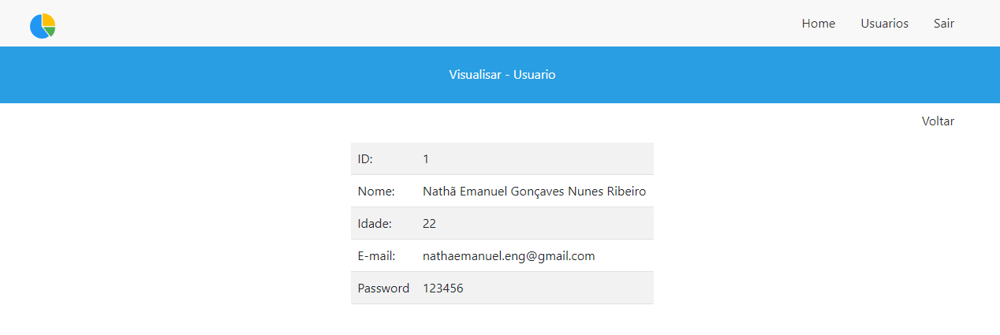</a>

---
    Funcionalidades 

- Login
- Register
- Logout
- Create
- Read
- Update
- Delete(Delete)
- Validações de campos

https://user-images.githubusercontent.com/92585791/175833348-0b3b83c0-aadb-41c6-909b-5291bef8903e.mp4

